# VMware Cloud Foundation (VCF) 9.x in a Box

Deploy a fully functional VMware Cloud Foundation (VCF) 9.x environment on a single or dual physical ESXi host, optimized for development and lab use. This setup enables users to explore and learn VCF with minimal compute and storage resources.

📒 This deployment does not use Nested ESXi and instead runs directly on physical hosts, in contrast to the [VCF Holodeck 9.0](https://vmware.github.io/Holodeck/) solution.

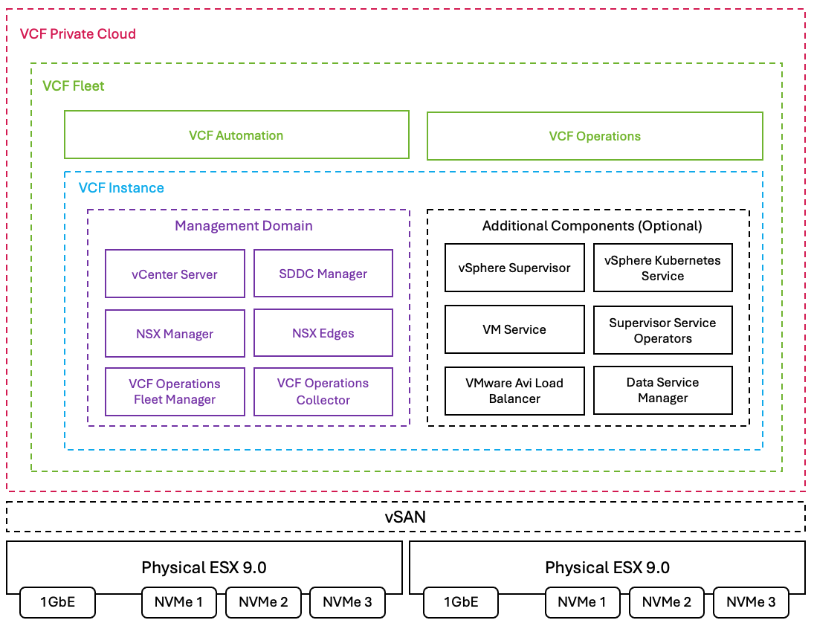

## Table of Contents

* [Changelog](#changelog)
* [Frequently Asked Questions (FAQ)](#frequently-asked-questions-faq)
* [Deployment Workflow Guide](#deployment-workflow-guide)
* [Using the Makefile](#using-the-makefile)
* [Quick Start](#quick-start)
* [Minimum Resources](#minimum-resources)
* [Build of Materials (BOM)](#build-of-materials-bom)
* [Pre-Requisite](#prereq)
* [Configuration Files](#configuration-files)
* [Automation Scripts](#automation-scripts)
* [Script Prerequisites](#script-prerequisites)
* [Installation](#installation)
* [Post Installation](#post-installation)
* [Troubleshooting](#troubleshooting)
* [Blog References](#blog-references)

## Changelog

* **10/20/25**
  * Updated VCF Installer configuration script to include VCF 9.0.1 enhancements
  * Updated blog post references

* **10/17/2025**
  * **Python Standardization:** Converted all scripts to Python for consistency
    * `deploy_vcf_installer.sh` → `deploy_vcf_installer.py` (with YAML config support)
    * `setup_vcf_installer.ps1` → `setup_vcf_installer.py` (using pyvmomi SDK)
    * `fix_vsan_esa_default_storage_policy.ps1` → `fix_vsan_esa_default_storage_policy.py` (using pyvmomi SDK)
  * **Dry-Run Support:** All deployment scripts now support `--dry-run` preview mode
  * **Unified Configuration:** All scripts read from single `vcf-config.yaml` file
  * **Makefile Enhancements:** Added targets for all new scripts with dry-run support
  * **Improved Documentation:** Updated README with Python script usage and Makefile commands
  * **FAQ Added:** Created comprehensive FAQ.md with common questions and detailed answers
  * **Dependencies:** Added pyvmomi and requests to pyproject.toml

* **10/16/25**
  * **YAML Configuration:** All settings now in easy-to-edit `vcf-config.yaml` file
  * **Comprehensive Workflow Guide:** Added `DEPLOYMENT_WORKFLOW.md` connecting all deployment steps
  * **ESXi Version Documentation:** Clearly documented ESXi 9.0.0.0 build 24755229 requirement throughout
  * **Dry-Run Support:** Added `--dry-run` flag to USB creation script for safe preview
  * Refactored kickstart generation to use Python with Jinja2 templates (DRY principle)
  * Converted USB creation to Python with YAML configuration support
  * Added Makefile for simplified command execution
  * Added third ESXi host support (esx03.vcf.lab)
  * Added three-node VCF manifest (`vcf90-three-node.json`)
  * Reorganized IP allocation (ESXi hosts: .10-.12, VCF Installer: .21)
  * Set up modern Python tooling with uv and pyproject.toml

* **10/04/25**
  * Add TPS Memory optimization to Kickstart

* **10/01/25**
  * Updated MS-A2 7945HX to 7940HX

* **08/29/2025**
  * Added post-install documentation section

* **07/28/2025**
  * Initial Release

## Frequently Asked Questions (FAQ)

**❓ NEW:** Common questions and answers about VCF 9.x in a Box deployment. See **[FAQ.md](FAQ.md)**.

**Popular topics:**

* Do I need 3 separate USB drives? (No, you can reuse one!)
* Does previous ESXi installation matter? (No, kickstart handles it!)
* How long does deployment take? (~5-6 hours total)
* What ESXi version is required? (9.0.0.0 build 24755229)
* When to run the vSAN policy fix script? (2-node only, immediately after deployment start)

See the full FAQ for detailed answers and many more questions.

## Deployment Workflow Guide

**📖 NEW:** For a comprehensive understanding of how all the scripts work together, see **[DEPLOYMENT_WORKFLOW.md](DEPLOYMENT_WORKFLOW.md)**.

This guide provides:

* Complete workflow from configuration to VCF deployment
* Step-by-step breakdown of each script and what it does
* How each step depends on the previous step
* File dependencies and data flow
* Detailed explanations of what happens at each stage
* Troubleshooting guidance

**Perfect for:** Understanding the complete deployment process and how each piece fits together.

## Using the Makefile

This project includes a comprehensive Makefile to simplify common tasks. No need to remember complex `uv` or Python commands.

### Quick Reference

```bash
# Show all available commands
make help

# Show project configuration info
make info
```

### Python Setup

```bash
# Install uv (if not already installed)
make setup

# Install dependencies (creates .venv automatically)
make sync

# Clean up virtual environment and generated files
make clean
```

### Generate ESXi Kickstart Configs

```bash
# Generate all kickstart configs (esx01, esx02, esx03)
make generate

# Generate config for specific host
make generate-1   # For esx01
make generate-2   # For esx02
make generate-3   # For esx03

# Or use: make generate-host HOST=3
```

### Create Bootable USB

```bash
# List available disk devices
make usb-list

# Create bootable USB for specific host
make usb-create USB=/dev/disk4 HOST=1
make usb-create USB=/dev/disk4 HOST=3
```

### Complete Workflow

```bash
# Clean, setup, and generate all configs
make all
```

### Customizing Configuration

All configuration is now managed via YAML. To customize host configurations:

1. Edit `config/vcf-config.yaml` (network settings, IPs, NVMe disks, etc.)
2. Run `make generate` to regenerate all configs

**Example customizations:**

```yaml
# config/vcf-config.yaml
network:
  gateway: "172.30.0.1"  # Change gateway
  vlan_id: "30"          # Change VLAN

hosts:
  - number: 1
    ip: "172.30.0.10"    # Change IP
    install_disk: "..."   # Update NVMe device ID
```

**Using custom config files:**

```bash
make generate CONFIG=config/my-custom-config.yaml
```

See [PYTHON_SETUP.md](PYTHON_SETUP.md) for detailed Python environment information.

## Quick Start

1. **Prepare hardware** (3x MS-A2 or similar with specs below)
2. **Configure network** (5 VLANs: 30, 40, 50, 60, 70)
3. **Setup VCF Offline Depot** on HTTP server
4. **Download ESXi 9.0.0.0 ISO** (build 24755229) - See [Software Requirements](#software-requirements)
5. **Generate kickstart configs:** `make generate`
6. **Create ESXi USB installers:** `make usb-create USB=/dev/disk4 HOST=1` (repeat for each host)
7. **Deploy ESXi 9.0.0.0** on all hosts (automated via kickstart) - **This MUST be done before VCF Installer deployment**
8. **Deploy VCF Installer:** `make deploy-vcf-installer`
9. **Configure VCF Installer:** `make setup-vcf-installer`
10. **Connect to Offline Depot** and download binaries
11. **Upload VCF deployment manifest** and start deployment
12. **Run storage policy fix** (two-node only): `make fix-vsan-policy`

**Total deployment time:** 3-4 hours

**⚠️ IMPORTANT:** All physical ESXi hosts must be running **ESXi 9.0.0.0 build 24755229** before deploying the VCF Installer (Step 8).

**Tip:** Use `make help` to see all available Makefile commands.

## Minimum Resources

### Per ESXi Host

* **CPU:** 16C/32T minimum (AMD Ryzen 9 7945HX or Intel equivalent)
* **RAM:** 128GB minimum
* **Storage:**
  * 500GB NVMe for ESXi OS, ESX-OSData & Local VMFS
  * 1-2TB NVMe for vSAN ESA
  * Optional: 1TB NVMe for NVMe Tiering
* **Network:** 2x 10GbE ports (SFP+ or RJ45)

### Network Infrastructure

* **Switch:** 10GbE switch with VLAN support
* **VLANs:** Minimum 5 VLANs configured (Management, vMotion, vSAN, TEP, Tier-0)
* **Router:** Optional for external connectivity

### Software Requirements

**Required Versions for VCF 9.0.0.0:**

* **ESXi 9.0.0.0** (build 24755229) - **CRITICAL: This exact version must be installed on hosts BEFORE deploying VCF Installer**
  * Download: [VMware Cloud Foundation Downloads](https://support.broadcom.com/)
  * ISO: `VMware-VMvisor-Installer-9.0.0.0.24755229.x86_64.iso`
  * Location in Offline Depot: `PROD/COMP/ESX_HOST/`
  * **When to install**: Step 1-7 (before running `make deploy-vcf-installer`)

* **VCF 9.0.0.0 Binaries** (downloaded via VCF Download Tool):
  * VCF Installer appliance (SDDC Manager)
  * vCenter Server 9.0.0.0 ISO
  * NSX-T 9.0.0.0 components
  * VCF Operations components (vROps, vRA, vRSLCM, etc.)

**Version Compatibility:**

* ESXi version MUST match the version specified in VCF 9.0.0.0 release notes
* All physical ESXi hosts must run the same ESXi build before VCF deployment
* VCF Installer will manage ESXi versions post-deployment via VCF lifecycle management

## Build of Materials (BOM)

* [VMware Cloud Foundation (VCF) 9.0.1.0](https://support.broadcom.com/group/ecx/productfiles?subFamily=VMware%20Cloud%20Foundation&displayGroup=VMware%20Cloud%20Foundation%209&release=9.0.1.0&os=&servicePk=&language=EN)
* [2 x Minisforum MS-A2 (7940HX) Barebones](https://amzn.to/46xuK3X)
  * [1 x Crucial 128GB Kit (2x64GB) DDR5 SODIMM](https://amzn.to/4bcpXFJ)
  * [2 x Dual 64GB DDR5 SODIMM (128GB)](https://amzn.to/4bcpXFJ)
  * 1 x USB Device (16GB or larger) for booting ESXi Installation
  * [2 x SK Hynix Gold P31 500GB NVME](https://amzn.to/4eKEQkm) for ESXi Installation, ESX-OSData & Local VMFS datastore
  * [2 x Sabrent Rocket 1TB NVMe](https://amzn.to/4ltaTYM) for NVMe Tiering
  * [2 x Samsung 990 EVO 2TB NVMe](https://amzn.to/4lQC403) for vSAN ESA
  * [1 x MikroTik CRS304-4XG-IN](https://amzn.to/44J1rt4) for Network Routing
  * [1 x Sodola 4 x 2.5GbE & 2 x 10GbE](https://amzn.to/4lQjZOw) for Network Switching

📒 The above BOM is just [one working example](https://williamlam.com/2025/07/vcf-9-0-hardware-bom-for-silicon-valley-vmug.html), you can certainly swap out components that you might already have or prefer alternatives, just know that you will be responsible for adjusting any configuration that may differ from referenced BOM.

## Configuration Files

The following configuration files are included in the `config/` directory:

| File | Purpose |
|------|---------|
| [`vcf-config.yaml`](config/vcf-config.yaml) | **Main configuration file** - Edit this to customize your deployment |
| [`ks-template.cfg.j2`](config/ks-template.cfg.j2) | Jinja2 template for ESXi kickstart configs (single source of truth) |
| [`ks-esx01.cfg`](config/ks-esx01.cfg) | ESXi kickstart configuration for first physical host (generated from YAML) |
| [`ks-esx02.cfg`](config/ks-esx02.cfg) | ESXi kickstart configuration for second physical host (generated from YAML) |
| [`ks-esx03.cfg`](config/ks-esx03.cfg) | ESXi kickstart configuration for third physical host (generated from YAML) |
| [`vcf90-two-node.json`](config/vcf90-two-node.json) | VCF deployment manifest for two-node fleet (failuresToTolerate=0) |
| [`vcf90-three-node.json`](config/vcf90-three-node.json) | VCF deployment manifest for three-node fleet (failuresToTolerate=1) |
| [`pi-hole.conf`](config/pi-hole.conf) | DNS server configuration (optional - for local DNS setup) |

## Automation Scripts

The following automation scripts are provided in the `scripts/` directory:

| Script | Purpose | Prerequisites |
|--------|---------|---------------|
| [`generate_kickstart.py`](scripts/generate_kickstart.py) | Generate ESXi kickstart configs from Jinja2 template and YAML config | Python 3.8+, uv, jinja2, pyyaml |
| [`create_esxi_usb.py`](scripts/create_esxi_usb.py) | Create bootable ESXi USB installer with kickstart config (supports `--dry-run`) | Python 3.8+, uv, pyyaml, macOS, ESXi ISO, sudo access |
| [`deploy_vcf_installer.py`](scripts/deploy_vcf_installer.py) | Deploy VCF Installer appliance via OVFTool (supports `--dry-run`) | Python 3.8+, uv, pyyaml, OVFTool, ESXi 9.0.0.0 with SSH enabled |
| [`setup_vcf_installer.py`](scripts/setup_vcf_installer.py) | Configure VCF Installer post-deployment settings (supports `--dry-run`) | Python 3.8+, uv, pyvmomi, requests |
| [`fix_vsan_esa_default_storage_policy.py`](scripts/fix_vsan_esa_default_storage_policy.py) | Auto-fix vSAN ESA storage policy for two-node deployments (supports `--dry-run`) | Python 3.8+, uv, pyvmomi |

## Script Prerequisites

### create_esxi_usb.py

**System Requirements:**

* Python 3.8+ with uv package manager
* macOS (for `diskutil` commands)
* ESXi 9.0.0.0 ISO (build 24755229)
* USB drive (16GB or larger)
* sudo access

**Configuration:**

* Edit `config/vcf-config.yaml` to customize host settings
* Or use `-c/--config` flag for custom config files
* Use `--dry-run` to preview operations without making changes

**Usage:**

```bash
# Preview (no root required)
uv run scripts/create_esxi_usb.py --dry-run /dev/disk4 1

# Create USB (requires sudo)
sudo make usb-create USB=/dev/disk4 HOST=1
```

### deploy_vcf_installer.py

**System Requirements:**

* Python 3.8+ with uv package manager
* **OVFTool:** Download and install from [Broadcom Developer Portal](https://developer.broadcom.com/tools/open-virtualization-format-ovf-tool/latest)
* **VCF Installer OVA:** Downloaded from VCF 9.0 binaries

**ESXi Host Requirements:**

* **CRITICAL:** ESXi 9.0.0.0 build 24755229 must be installed and running
* SSH enabled on target ESXi host
* Root credentials
* Datastore with 15-20GB free space

**Configuration:**

* Edit `config/vcf-config.yaml` to customize VCF Installer deployment settings
* Or use `-c/--config` flag for custom config files
* Use `--dry-run` to preview deployment without making changes

**Usage:**

```bash
# Preview deployment
make deploy-vcf-installer-dry-run

# Deploy VCF Installer
make deploy-vcf-installer

# Or use direct Python command
uv run scripts/deploy_vcf_installer.py --dry-run
uv run scripts/deploy_vcf_installer.py
```

### setup_vcf_installer.py

**System Requirements:**

* Python 3.8+ with uv package manager
* Network access to ESXi host and VCF Installer appliance
* VMware Tools running in VCF Installer VM

**Configuration:**

* Edit `config/vcf-config.yaml` to customize VCF Installer settings
* Or use `-c/--config` flag for custom config files
* Use `--dry-run` to preview configuration without making changes

**Usage:**

```bash
# Preview configuration
make setup-vcf-installer-dry-run

# Configure VCF Installer
make setup-vcf-installer

# Or use direct Python command
uv run scripts/setup_vcf_installer.py --dry-run
uv run scripts/setup_vcf_installer.py
```

### fix_vsan_esa_default_storage_policy.py

**System Requirements:**

* Python 3.8+ with uv package manager
* Network access to vCenter Server (will be deployed by VCF)
* vCenter Server credentials from `config/vcf-config.yaml`

**Configuration:**

* Edit `config/vcf-config.yaml` with vCenter credentials
* Or use `-c/--config` flag for custom config files
* Use `--dry-run` to preview changes without making them

**Usage:**

```bash
# Preview policy fix
make fix-vsan-policy-dry-run

# Fix vSAN storage policy (2-node only)
make fix-vsan-policy

# Or use direct Python command
uv run scripts/fix_vsan_esa_default_storage_policy.py --dry-run
uv run scripts/fix_vsan_esa_default_storage_policy.py
```

**When to Run:**
For two-node deployments **ONLY**, run this script **immediately after starting the VCF deployment** (Step 11) to proactively prevent vSAN storage policy failures. Three-node deployments do NOT need this fix.

## Prereq

* Minimum 5 VLANs (e.g. 30, 40, 50, 60) for VCF Fleet Deployment
  * VLAN 30 - Management
  * VLAN 40 - vMotion
  * VLAN 50 - vSAN
  * VLAN 60 - ESX/NSX Edge TEP
  * VLAN 70 - Tier 0 Uplink (Optional)

* Here are the following IP Addresses/DNS entries that you will need for initial setup (NSX Edge, Supervisor/VKS are optional)

| Hostname   | FQDN                | IP Address   | Function                                 |
|------------|---------------------|--------------|------------------------------------------|
| dns        | dns.vcf.lab         | 192.168.10.2 | DNS Server                               |
| vc01       | vc01.vcf.lab        | 172.30.0.10  | vCenter Server for Management Domain     |
| esx01      | esx01.vcf.lab       | 172.30.0.11  | Physical ESX-1 Server                    |
| esx02      | esx02.vcf.lab       | 172.30.0.12  | Physical ESX-2 Server                    |
| esx03      | esx03.vcf.lab       | 172.30.0.13  | Physical ESX-3 Server                    |
| vcf01      | vcf01.vcf.lab       | 172.30.0.14  | VCF Operations                           |
| nsx01      | nsx01.vcf.lab       | 172.30.0.15  | NSX Manager VIP for Management Domain    |
| nsx01a     | mgmt-nsx01a.vcf.lab | 172.30.0.16  | NSX Manager for Management Domain        |
| edge01a    | edge01a.vcf.lab     | 172.30.0.17  | NSX Edge 1a for Management Domain        |
| edge01b    | edge01b.vcf.lab     | 172.30.0.18  | NSX Edge 1b for Management Domain        |
| opsfm01    | opsfm01.vcf.lab     | 172.30.0.19  | VCF Operations Fleet Manager             |
| opsproxy01 | opsproxy01.vcf.lab  | 172.30.0.20  | VCF Operations Proxy Collector           |
| sddcm01    | sddcm01.vcf.lab     | 172.30.0.21  | VCF Installer / SDDC Manager             |
| auto01     | auto01.vcf.lab      | 172.30.0.30  | VCF Automation                           |
| sv01       | sv01.vcf.lab        | 172.30.0.40  | VKS Supervisor                           |

## Installation

0. Update to the latest Firmware on the MS-A2 (if applicable) by following [these instructions](https://williamlam.com/2025/07/quick-tip-updating-firmware-on-minisforum-ms-a2.html).

1. Setup a VCF Offline Depot using the new `VCF Download Tool` by following the [Broadcom doumentation](https://techdocs.broadcom.com/us/en/vmware-cis/vcf/vcf-9-0-and-later/9-0/deployment/deploying-a-new-vmware-cloud-foundation-or-vmware-vsphere-foundation-private-cloud-/preparing-your-environment/downloading-binaries-to-the-vcf-installer-appliance/download-install-binaries-to-an-offline-depot.html)

After downloading the required metadata/binaries, you should have a directory structure like the following:

```sh
 PROD
    ├── COMP
    │   ├── ESX_HOST
    │   │   └── VMware-VMvisor-Installer-9.0.0.0.24755229.x86_64.iso
    │   ├── NSX_T_MANAGER
    │   │   ├── VMware-NSX-T-9.0.0.0.24733065.vlcp
    │   │   └── nsx-unified-appliance-9.0.0.0.24733065.ova
    │   ├── SDDC_MANAGER_VCF
    │   │   ├── Compatibility
    │   │   │   └── VmwareCompatibilityData.json
    │   │   └── VCF-SDDC-Manager-Appliance-9.0.0.0.24703748.ova
    │   ├── VCENTER
    │   │   └── VMware-VCSA-all-9.0.0.0.24755230.iso
    │   ├── VCF_OPS_CLOUD_PROXY
    │   │   └── Operations-Cloud-Proxy-9.0.0.0.24695833.ova
    │   ├── VRA
    │   │   └── vmsp-vcfa-combined-9.0.0.0.24701403.tar
    │   ├── VROPS
    │   │   └── Operations-Appliance-9.0.0.0.24695812.ova
    │   └── VRSLCM
    │       └── VCF-OPS-Lifecycle-Manager-Appliance-9.0.0.0.24695816.ova
    ├── metadata
    │   ├── manifest
    │   │   └── v1
    │   │       └── vcfManifest.json
    │   └── productVersionCatalog
    │       └── v1
    │           ├── productVersionCatalog.json
    │           └── productVersionCatalog.sig
    └── vsan
        └── hcl
            ├── all.json
            └── lastupdatedtime.json

19 directories, 15 files
```

You can host the VCF Offline Depot using a traditional HTTP Web Server (HTTPS is NOT required as the automation in 9 will disable HTTPS). Alternatively, you can simply use Python to serve up the directory (see this [blog post](https://williamlam.com/2025/06/using-http-with-vcf-9-0-installer-for-offline-depot.html)) or even a Synology (see this [blog post](https://williamlam.com/2025/06/vcf-9-0-offline-depot-using-synology.html)).

2. **Create bootable ESXi USB installers**

📒 **IMPORTANT:** You MUST use **ESXi 9.0.0.0 build 24755229** (or the version specified in your VCF 9.0.0.0 release notes). Using a different ESXi version will cause VCF deployment failures.

**ISO Location:** `VMware-VMvisor-Installer-9.0.0.0.24755229.x86_64.iso` from your VCF Offline Depot at `PROD/COMP/ESX_HOST/`

**Create USB installers using the automated script:**

```bash
# Dry run first (preview without changes)
uv run scripts/create_esxi_usb.py --dry-run /dev/disk4 1

# Create USB for each host
sudo make usb-create USB=/dev/disk4 HOST=1
sudo make usb-create USB=/dev/disk4 HOST=2
sudo make usb-create USB=/dev/disk4 HOST=3
```

**Alternative:** Manual creation using [UNetbootin](https://unetbootin.github.io/) (see steps below)

3. We will be performing a scripted installation of ESXi (aka ESXi Kickstart) to remove the number of manual steps that would be needed during the post-installation of ESXi.

4. Edit the ESXi kickstart configuration files and replace the following values with your own desired configurations:
   * [`config/ks-esx01.cfg`](config/ks-esx01.cfg) for first physical host
   * [`config/ks-esx02.cfg`](config/ks-esx02.cfg) for second physical host

💡 To simplify the deployment of multiple ESXi hosts using a single USB drive, you can [create custom UEFI boot menu for ESXi](https://williamlam.com/2025/07/custom-uefi-boot-menu-for-esxi-9-0-using-refind.html), allowing you to select specific ESXi Kickstart configuration files.

📒 In order to identify the NVMe device label for the ESXi Installation and `ESXI_NVME_TIERING_AND_OSDATA_AND_VMFS` variable, you will need to boot the ESXi installer intially and switch to console (ALT+F1) and login with `root` and blank for the password (just hit enter). Enable SSH `/etc/init.d/SSH start` and then identify the IP Address which will allow you to SSH to ESXi host, which is running in memory and run the `vdq -q` command and list all storage devices. Identify the device you wish to use for ESX OS-Data, NVMe Tiering & local VMFS and make a note of the label as shown in the screenshot below.

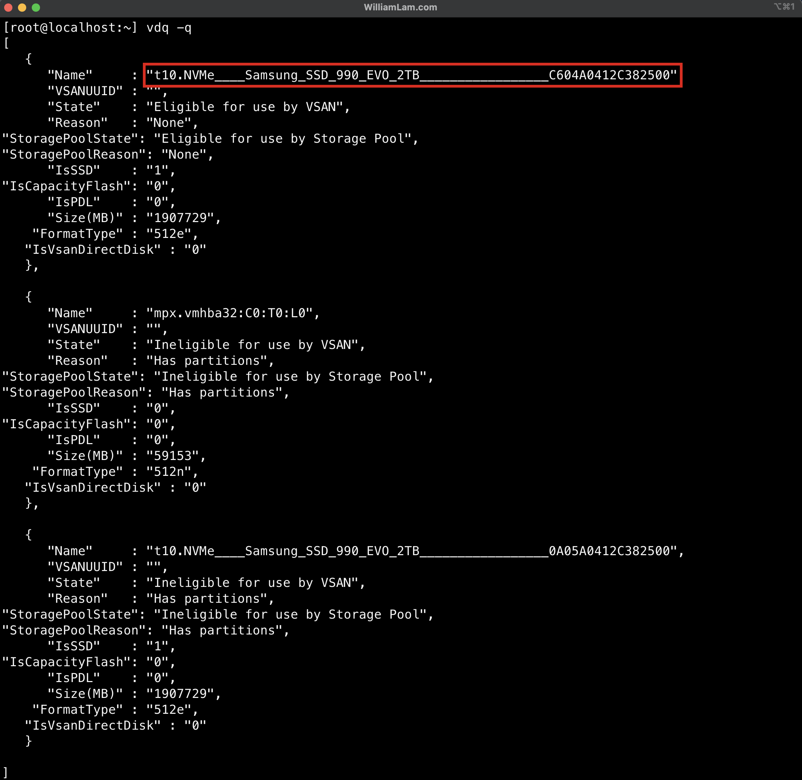

After creating the bootable ESXi installer on your USB device, copy your modified [ks-esx01.cfg](config/ks-esx01.cfg)/[ks-esx02.cfg](config/ks-esx02.cfg) into the root directory of the USB device, which should be renamed to `KS.CFG` (all caps)

Now, navigate into the USB device under `EFI/BOOT` and edit `BOOT.CFG` and update the `kernelopt` so it matches the following which will run our KS.CFG instead of the interactive installation:

```code
bootstate=0
title=Loading ESXi installer
timeout=5
prefix=
kernel=/b.b00
kernelopt=ks=usb:/KS.CFG
modules=/jumpstrt.gz --- /useropts.gz --- /features.gz --- /k.b00 --- /uc_intel.b00 --- /uc_amd.b00 --- /uc_hygon.b00 --- /procfs.b00 --- /vmx.v00 --- /vim.v00 --- /tpm.v00 --- /sb.v00 --- /s.v00 --- /atlantic.v00 --- /bcm_mpi3.v00 --- /bnxtnet.v00 --- /bnxtroce.v00 --- /brcmfcoe.v00 --- /cndi_igc.v00 --- /dwi2c.v00 --- /elxiscsi.v00 --- /elxnet.v00 --- /i40en.v00 --- /iavmd.v00 --- /icen.v00 --- /igbn.v00 --- /intelgpi.v00 --- /ionic_cl.v00 --- /ionic_en.v00 --- /irdman.v00 --- /iser.v00 --- /ixgben.v00 --- /lpfc.v00 --- /lpnic.v00 --- /lsi_mr3.v00 --- /lsi_msgp.v00 --- /lsi_msgp.v01 --- /lsi_msgp.v02 --- /mtip32xx.v00 --- /ne1000.v00 --- /nenic.v00 --- /nfnic.v00 --- /nhpsa.v00 --- /nipmi.v00 --- /nmlx5_cc.v00 --- /nmlx5_co.v00 --- /nmlx5_rd.v00 --- /ntg3.v00 --- /nvme_pci.v00 --- /nvmerdma.v00 --- /nvmetcp.v00 --- /nvmxnet3.v00 --- /nvmxnet3.v01 --- /pvscsi.v00 --- /qcnic.v00 --- /qedentv.v00 --- /qedrntv.v00 --- /qfle3.v00 --- /qfle3f.v00 --- /qfle3i.v00 --- /qflge.v00 --- /rdmahl.v00 --- /rshim_ne.v00 --- /rshim.v00 --- /rste.v00 --- /sfvmk.v00 --- /smartpqi.v00 --- /vmkata.v00 --- /vmksdhci.v00 --- /vmkusb.v00 --- /vmw_ahci.v00 --- /bmcal.v00 --- /clusters.v00 --- /crx.v00 --- /drivervm.v00 --- /elx_esx_.v00 --- /btldr.v00 --- /dvfilter.v00 --- /esx_ui.v00 --- /esxupdt.v00 --- /tpmesxup.v00 --- /weaselin.v00 --- /esxio_co.v00 --- /infravis.v00 --- /loadesx.v00 --- /lsuv2_hp.v00 --- /lsuv2_in.v00 --- /lsuv2_ls.v00 --- /lsuv2_nv.v00 --- /lsuv2_oe.v00 --- /lsuv2_oe.v01 --- /lsuv2_sm.v00 --- /native_m.v00 --- /qlnative.v00 --- /trx.v00 --- /vcls_pod.v00 --- /vdfs.v00 --- /vds_vsip.v00 --- /vmware_e.v00 --- /hbrsrv.v00 --- /vsan.v00 --- /vsanheal.v00 --- /vsanmgmt.v00 --- /tools.t00 --- /xorg.v00 --- /gc.v00 --- /imgdb.tgz --- /basemisc.tgz --- /resvibs.tgz --- /esxiodpt.tgz --- /imgpayld.tgz
build=8.0.3-0.35.24280767
updated=0
```

📒 If you are performing the installation on two physical ESXi host, the only change that is required is to update KS.CFG for ks-esx01.cfg and ks-esx02.cfg respecitvely, you can even change it to `KS1.CFG` and `KS2.CFG` to ensure you know which one was copied onto the USB device.

5. Plug the USB device into your system and power on to begin the ESXi installation. If you are performing a scripted installation, you may come across this warning, you can ignore and either wait or press enter to continue with the installation

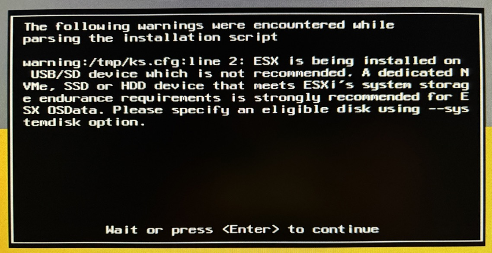

6. Once the ESXi reboot (there is a secondary reboot as part of the ESXi scripted installation), you should be able to login to your ESXi host using the FQDN and see something like the following:

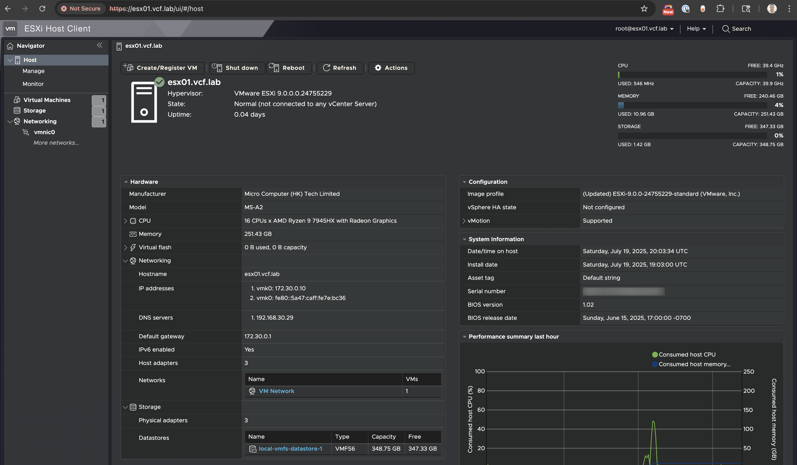

7. (Optional) If you do not already have a DNS server running within your enviornment or would like to localized this setup, you can deploy a VMware PhotonOS VM and use that as your DNS server. You can use my [pi-hole.conf](config/pi-hole.conf) as an exmaple setup and copy it to `/etc/unbound/unbound.conf.d/pi-hole.conf` directory after installing Unbound following the snippet below:

```
tdnf update -y
tdnf install unbound -y
systemctl stop iptables
systemctl disable iptables
systemctl enable unbound
systemctl restart unbound

rm -f /etc/resolv.conf
cat > /etc/resolv.conf <<EOF
nameserver 192.168.10.2
search vcf.lab
EOF
```

📒 If you are going to run a local DNS Server on the ESXi hosts that will deploy VCF 9.0, you should specify the final DNS Server IP Address and DNS Domain when provisioning your ESXi hosts. This will ensure that everything will resolve once you deploy your DNS Server, which will happen _after_ your ESXi hosts have been provisioned and removes and additional step by needing to update the DNS information.

8. Deploy the VCF Installer appliance using the [`deploy_vcf_installer.py`](scripts/deploy_vcf_installer.py) script.

   **Prerequisites:**
   * Python 3.8+ with uv (`make setup` and `make sync`)
   * OVFTool installed (download from [Broadcom Developer Portal](https://developer.broadcom.com/tools/open-virtualization-format-ovf-tool/latest))
   * VCF Installer OVA downloaded to your local system

   **Configuration:**
   Edit `config/vcf-config.yaml` to match your environment:
   * VCF Installer OVA path
   * Target ESXi host selection
   * VCF Installer networking (IP, hostname, passwords)
   * Network and datastore settings

   **Run the script:**

   ```bash
   # Preview deployment first (recommended)
   make deploy-vcf-installer-dry-run

   # Deploy VCF Installer
   make deploy-vcf-installer

   # Or use direct Python command
   uv run scripts/deploy_vcf_installer.py
   ```

   The script will deploy the VCF Installer appliance and wait for it to power on.

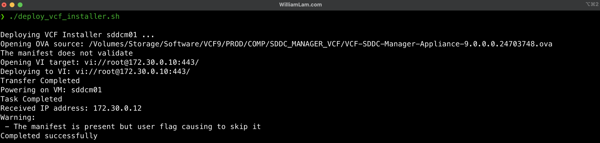

9. After the VCF Installer is up and running, configure it using the [`setup_vcf_installer.py`](scripts/setup_vcf_installer.py) script.

   **Run the script:**

   ```bash
   # Preview configuration first (recommended)
   make setup-vcf-installer-dry-run

   # Configure VCF Installer
   make setup-vcf-installer

   # Or use direct Python command
   uv run scripts/setup_vcf_installer.py
   ```

   The script will wait for the VCF Installer UI to be ready, then apply the necessary configuration changes.

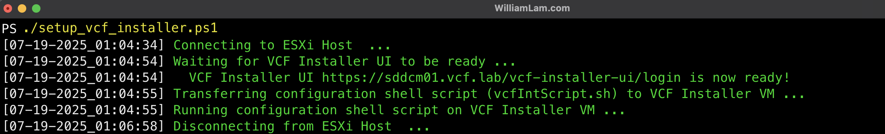

10. Before we can deploy our VCF 9 envrionment, we need to connect to our VCF Offline Depot that you had setup from Step 1.

Open browser to VCF Installer (e.g. <https://sddcm01.vcf.lab/>) and login with username `admin@local` and the password you had configured from Step 8 and then click on `DEPOT SETTINGS AND BINARY MANAGEMENT` button.

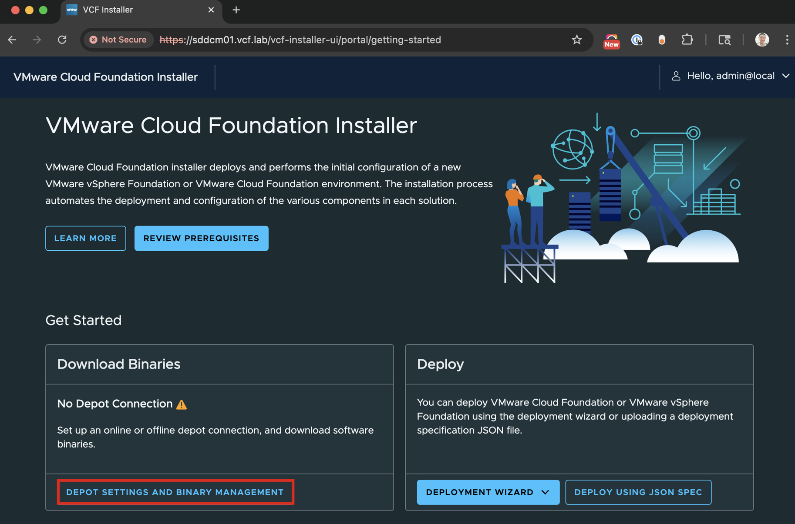

Connect to your VCF Offline Depot and it should show active if everything was configured correctly.


Once the VCF metadata has been pulled from your VCF Offline Depot, click on the `DOWNLOAD` button to beging downlaoding the required VCF binaries and ensure you have `Success` status for each item listed in the table.

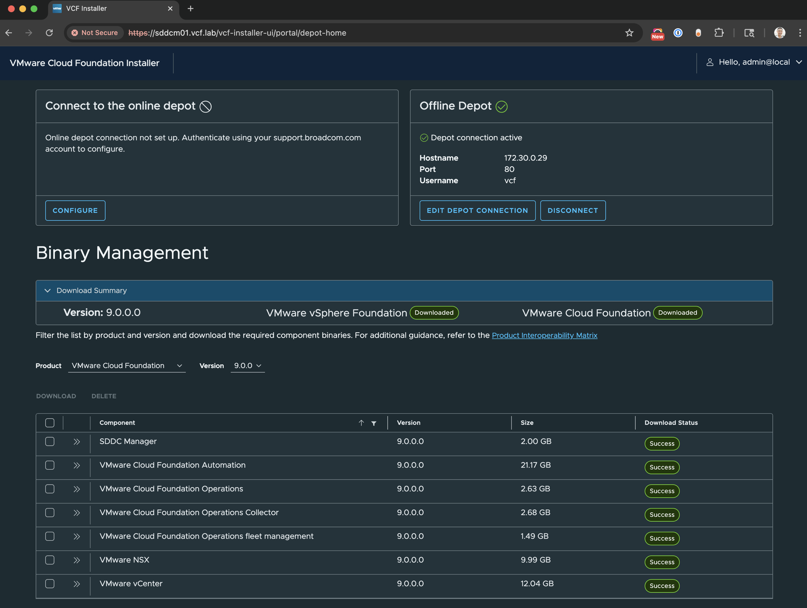

11. Navigate back to the VCF Installer homepage and click on `DEPLOY USING JSON SPEC` to begin your VCF deployment.

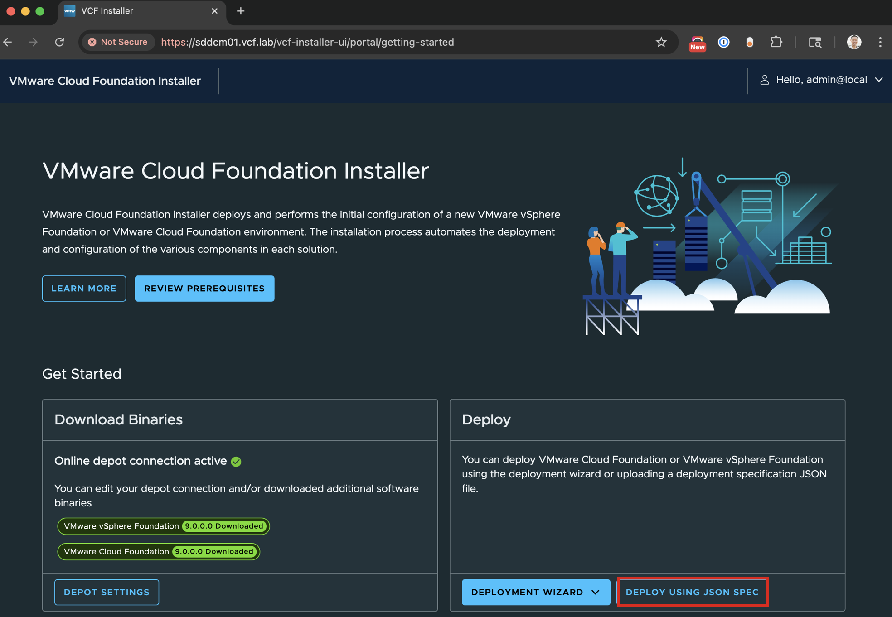

Upload your VCF deployment manifest and click `Next` to begin the validation.

**Choose the appropriate manifest:**

* **Two-node cluster:** Use [`vcf90-two-node.json`](config/vcf90-two-node.json) (requires `make fix-vsan-policy`)
* **Three-node cluster:** Use [`vcf90-three-node.json`](config/vcf90-three-node.json) (standard vSAN configuration)

📒 **Note:** The three-node configuration is recommended as it provides proper vSAN fault tolerance (FTT=1) and doesn't require the storage policy fix script.

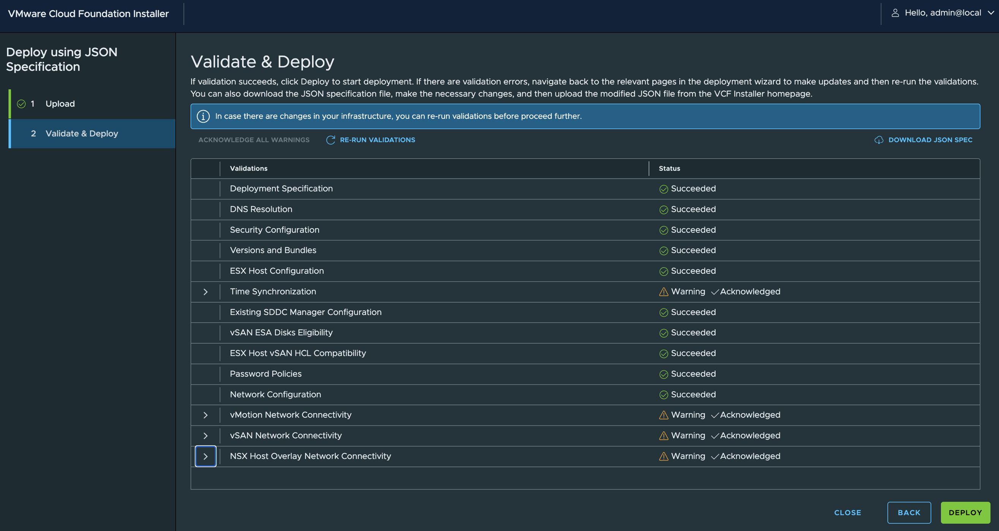

📒 You may encounter some of the pre-checks where you need to acknowledge to continue. I have noticed when using certain MikroTik devices, even though Jumbo Frames (MTU=9K) has been configured, it fails the validation but the deployment is still successful, so simply acknowledge the configuration

Once you have fixed and/or acknowledge all applicable pre-check, click on `DEPLOY` to start the deployment.

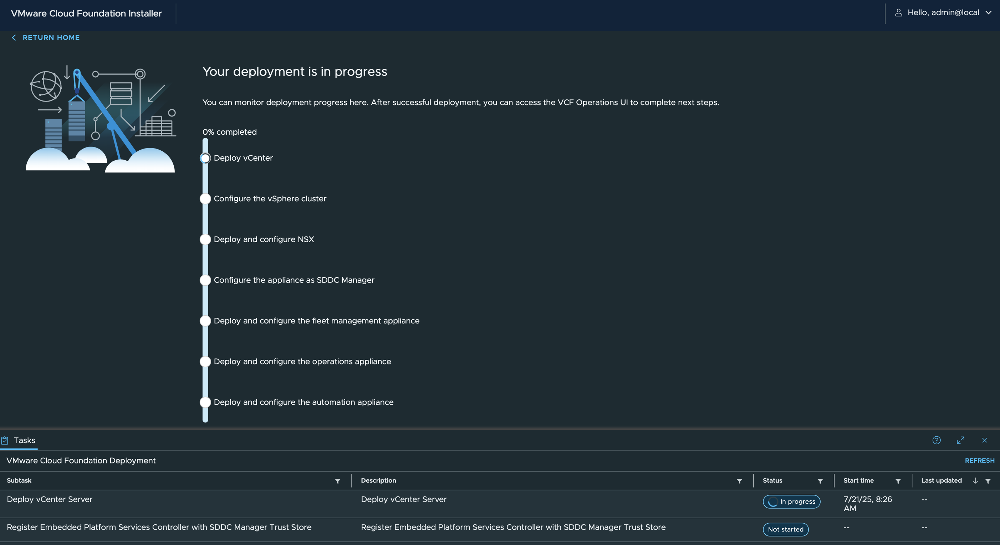

12. **[IMPORTANT - Two-Node Deployments Only]** Fix vSAN ESA Storage Policy proactively to prevent deployment failure.

   **Background:** For two-node physical ESXi host deployments, the VCF deployment will fail after vCenter Server is deployed due to inability to apply the default vSAN ESA Storage Policy (which requires 3 hosts by default with FTT=1).

   **When to Run:** **ONLY if you used `vcf90-two-node.json`**. Three-node deployments using `vcf90-three-node.json` do NOT need this fix.

   **Proactive Fix:** Run the [`fix_vsan_esa_default_storage_policy.py`](scripts/fix_vsan_esa_default_storage_policy.py) script **immediately after starting the VCF deployment** (Step 11). This script monitors vCenter Server deployment and automatically updates the vSAN storage policy when created, preventing deployment failure.

   **Run the script:**

   ```bash
   # Preview what the script will do (recommended)
   make fix-vsan-policy-dry-run

   # Fix the storage policy
   make fix-vsan-policy

   # Or use direct Python command
   uv run scripts/fix_vsan_esa_default_storage_policy.py
   ```

   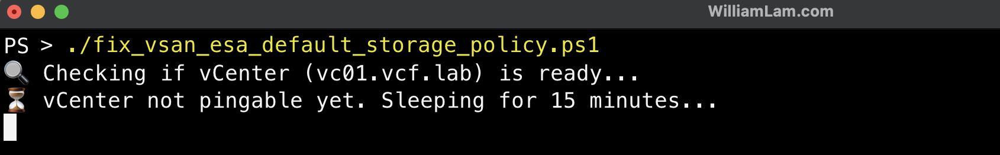

   The script will:

* Wait until vCenter Server is available (monitors ping and connection readiness)
* Wait for vSAN ESA Storage Policy creation
* Automatically update the policy from FTT=1 to FTT=0 (required for 2-node)
* Prevent deployment failure that would require manual remediation

   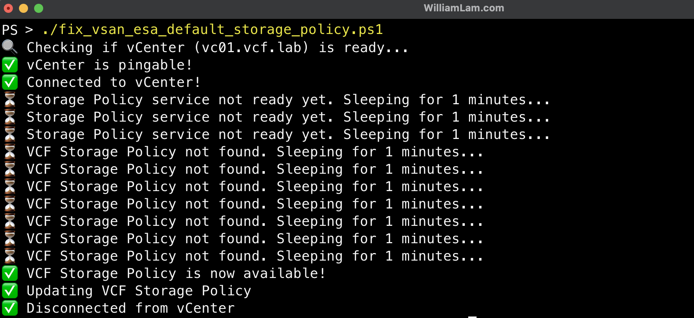

   **Note:** This step is **only required** for two-host deployments. Three or more host deployments do not need this fix. The script automatically detects host count from `config/vcf-config.yaml` and skips execution if not needed.

13. The deployment will take a few hours and once everything has been deployed, you should see a success page like the following:


You can login to your brand new VCF 9.0 deployment by clicking on the link to login to VCF Operations and `admin` credentials you had specified in your deployment manifest.

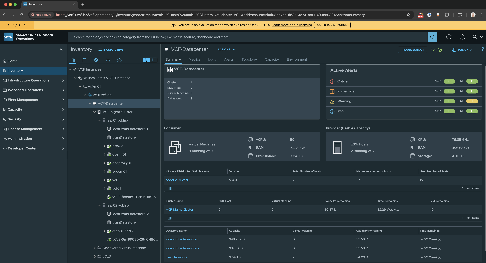

## Post Installation

Now that you have a fully functional VCF 9 Fleet fully deployed, here are some things you may want to explore and try out:

* 🌐 [Configuring NSX Virtual Private Cloud (VPC)](https://williamlam.com/2025/07/ms-a2-vcf-9-0-lab-configuring-nsx-virtual-private-cloud-vpc.html)
* 🔩 [Configuring vSphere Supervisor with NSX VPC Networking](https://williamlam.com/2025/08/ms-a2-vcf-9-0-lab-configuring-vsphere-supervisor-with-nsx-vpc-networking.html)
* 📦 [Configuring vSphere Kubernetes Service (VKS)](https://williamlam.com/2025/08/ms-a2-vcf-9-0-lab-configuring-vsphere-kubernetes-service-vks.html)
* ⚙️ [Configuring VCF Automation](https://williamlam.com/2025/08/ms-a2-vcf-9-0-lab-configuring-vcf-automation.html)
* 🔐 [Configuring External IdP for Multiple VCF Automation Organizations](https://williamlam.com/2025/08/ms-a2-vcf-9-0-lab-configuring-external-idp-for-multiple-vcf-automation-organizations.html)
* 🧠 Configuring Private AI Services (PAIS)
  * [Installing PAIS](https://williamlam.com/2025/09/ms-a2-vcf-9-0-lab-installing-vmware-private-ai-services-pais.html)
  * [Configuring Data Services Manager (DSM) for PAIS](https://williamlam.com/2025/09/ms-a2-vcf-9-0-lab-configuring-data-services-manager-dsm-for-vmware-private-ai-services-pais.html)
  * [Configuring Authentik Identity Provider PAIS](https://williamlam.com/2025/09/ms-a2-vcf-9-0-lab-configuring-authentik-identity-provider-vmware-for-private-ai-services-pais.html)
  * [Configuring Model Store using Harbor for PAIS](https://williamlam.com/2025/09/ms-a2-vcf-9-0-lab-configuring-model-store-using-harbor-for-vmware-for-private-ai-services-pais.html)
  * [Deploying PAIS](https://williamlam.com/2025/10/ms-a2-vcf-9-0-lab-deploying-vmware-private-ai-services-pais.html)
  * [Deploying Model Endpoint with DirectPath I/O using PAIS](https://williamlam.com/2025/10/ms-a2-vcf-9-0-lab-deploying-model-endpoint-with-directpath-i-o-using-vmware-for-private-ai-services-pais.html)

## Troubleshooting

### ESXi Installation Issues

**Problem:** Cannot identify NVMe device labels for kickstart configuration

* **Solution:** Boot ESXi installer, press ALT+F1, login as root (blank password), run `/etc/init.d/SSH start`, then SSH to the host and run `vdq -q` to list all storage devices

**Problem:** ESXi kickstart installation fails to boot

* **Solution:** Verify `BOOT.CFG` has been edited correctly with `kernelopt=ks=usb:/KS.CFG` and that the KS.CFG file is in the root of the USB device

**Problem:** Wrong ESXi host gets wrong configuration

* **Solution:** Consider renaming kickstart files to `KS1.CFG` and `KS2.CFG` and creating custom UEFI boot menu (see [this blog post](https://williamlam.com/2025/07/custom-uefi-boot-menu-for-esxi-9-0-using-refind.html))

### VCF Installer Deployment Issues

**Problem:** OVFTool fails with authentication error

* **Solution:** Verify SSH is enabled on ESXi host and credentials are correct in the script

**Problem:** OVFTool fails with network/datastore not found error

* **Solution:** Verify port group name (e.g., `VM Network`) and datastore name (e.g., `local-vmfs-datastore-1`) match exactly in the script

**Problem:** VCF Installer appliance doesn't get IP address

* **Solution:** Check network configuration in script (IP, gateway, subnet mask) and verify VLAN configuration on physical switch

### VCF Deployment Issues

**Problem:** Pre-check validation fails for MTU/Jumbo Frames

* **Solution:** If using MikroTik devices, this is a known issue. Acknowledge the warning if you've confirmed Jumbo Frames are configured correctly

**Problem:** vSAN ESA Storage Policy error on two-node deployment

* **Solution:** Run `make fix-vsan-policy` (or `uv run scripts/fix_vsan_esa_default_storage_policy.py`) immediately after starting VCF deployment (see Step 12)

**Problem:** VCF Offline Depot connection fails

* **Solution:** Verify HTTP server is running, firewall allows traffic, and the depot URL is correct. HTTPS is not required for VCF 9.0

**Problem:** Binary download fails from Offline Depot

* **Solution:** Verify all binaries are in the correct directory structure and the HTTP server has read permissions

### DNS Issues

**Problem:** Hostnames not resolving during deployment

* **Solution:** Verify DNS server is running and reachable, all required DNS entries are configured, and ESXi hosts have correct DNS settings

**Problem:** DNS server not accessible after deployment

* **Solution:** If running DNS on ESXi host, verify the VM is powered on and the DNS service (unbound) is running

### Network Issues

**Problem:** VLANs not working correctly

* **Solution:** Verify VLAN IDs are configured on physical switch, trunk ports are configured correctly, and VLANs match between physical switch and VCF deployment manifest

**Problem:** 10GbE connectivity issues

* **Solution:** Verify SFP+ cables/transceivers are compatible, ports are enabled on switch, and link lights are active on both ends

## Blog References

* [VMware Cloud Foundation (VCF) on Minisforum MS-A2](https://williamlam.com/2025/06/vmware-cloud-foundation-vcf-on-minisforum-ms-a2.html)
* [VCF 9.0 Hardware BOM for Silicon Valley VMUG](https://williamlam.com/2025/07/vcf-9-0-hardware-bom-for-silicon-valley-vmug.html)
* [Ultimate Lab Resource for VCF 9.0](https://williamlam.com/2025/06/ultimate-lab-resource-for-vcf-9-0.html)
* [Using HTTP with VCF 9.0 Installer for Offline Depot](https://williamlam.com/2025/06/using-http-with-vcf-9-0-installer-for-offline-depot.html)
* [Quick Tip - Easily host VMware Cloud Foundation (VCF) Offline Depot using Python SimpleHTTPServer with Authentication](https://williamlam.com/2025/01/quick-tip-easily-host-vmware-cloud-foundation-vcf-offline-depot-using-python-simplehttpserver-with-authentication.html)
* [Enhancement in VCF 9.0.1 to bypass vSAN ESA HCL & Host Commission 10GbE NIC Check](https://williamlam.com/2025/09/enhancement-in-vcf-9-0-1-to-bypass-vsan-esa-hcl-host-commission-10gbe-nic-check.html)
* [Disable 10GbE NIC Pre-Check in the VCF 9.0 Installer](https://williamlam.com/2025/06/disable-10gbe-nic-pre-check-in-the-vcf-9-0-installer.html)
* [Deploying VCF 9.0 on a single ESXi host?](https://williamlam.com/2025/06/deploying-vcf-9-0-on-a-single-esxi-host.html)
* [vSAN ESA Disk & HCL workaround for VCF 9.0](https://williamlam.com/2025/06/vsan-esa-disk-hcl-workaround-for-vcf-9-0.html)
* [Initial Mikrotik router/switch configuration for VCF 9.0](https://williamlam.com/2025/07/initial-mikrotik-router-switch-configuration-for-vcf-9-0.html)
